<div align="center">


<h1>Chatbot Accelerator</h1>

<p><strong>The Enterprise Flagship Platform for Secure, Governed, and Scalable GenAI Assistants</strong></p>

[]()
[]()
[]()
[]()
[]()

<br/>

> **"Unlocking Enterprise Intelligence at Scale."** 
> Chatbot Accelerator is an industrial-grade foundation for deploying private, RAG-powered AI assistants that adhere to the strictest enterprise governance, security, and operational standards.

</div>

---

## 🏛️ Executive Summary

In the rapidly evolving landscape of Generative AI, enterprise organizations face a critical challenge: how to move beyond experimental "playground" bots to production-grade assistants that are secure, governed, and integrated with institutional knowledge. 

**Chatbot Accelerator** is a comprehensive, production-ready platform engineered to solve this challenge. It provides a modular architecture for building, deploying, and managing multi-channel AI assistants—from ITSM support bots to sophisticated HR assistants—utilizing **Azure OpenAI**, **pgvector**, and a high-performance **FastAPI** backend.

---

## 🚀 Business Outcomes & Use Cases

### 🎯 Key Business Outcomes
- **Reduced Time-to-Market**: Deploy production-ready AI assistants in days instead of months.
- **Operational Efficiency**: Automate up to 60% of common internal support queries.
- **Cost Optimization**: Standardized token management and model routing to minimize GenAI spend.
- **Enhanced Security**: Zero-trust networking and PII redaction ensure data privacy and compliance.

### 💼 High-Impact Use Cases
| Use Case | Description | Target Audience |
|---|---|---|
| **ITSM Support Bot** | Instant resolution for password resets, VPN access, and ticket status. | Internal Employees |
| **HR Assistant** | Automated guidance on policy, benefits, and payroll. | Human Resources |
| **Enterprise Search** | RAG-powered search across internal wikis, SharePoint, and PDFs. | All Departments |
| **Developer Copilot** | Internal documentation and coding standard assistant. | Engineering |

---

## 🛠️ Technical Stack

| Layer | Technology | Rationale |
|---|---|---|
| **Cloud** | Azure | Enterprise-grade reliability and native OpenAI integration. |
| **AI Engine** | Azure OpenAI (GPT-4o/GPT-3.5) | Sovereign model hosting with data privacy guarantees. |
| **Frontend** | React 18, Vite, Tailwind CSS | High-performance, responsive UI with modern DX. |
| **Backend** | FastAPI (Python) | High-concurrency, asynchronous API gateway. |
| **Vector DB** | PostgreSQL + pgvector | Unified relational and semantic search storage. |
| **Orchestration** | Redis + Celery/Worker | Scalable async ingestion and document processing. |
| **Infra (IaC)** | Terraform | Declarative, version-controlled infrastructure. |
| **Deployment** | AKS (Kubernetes) | Scalable, resilient container orchestration. |

---

## 📐 Architecture Storytelling: 50+ Diagrams

### 1. High-Level Platform Architecture
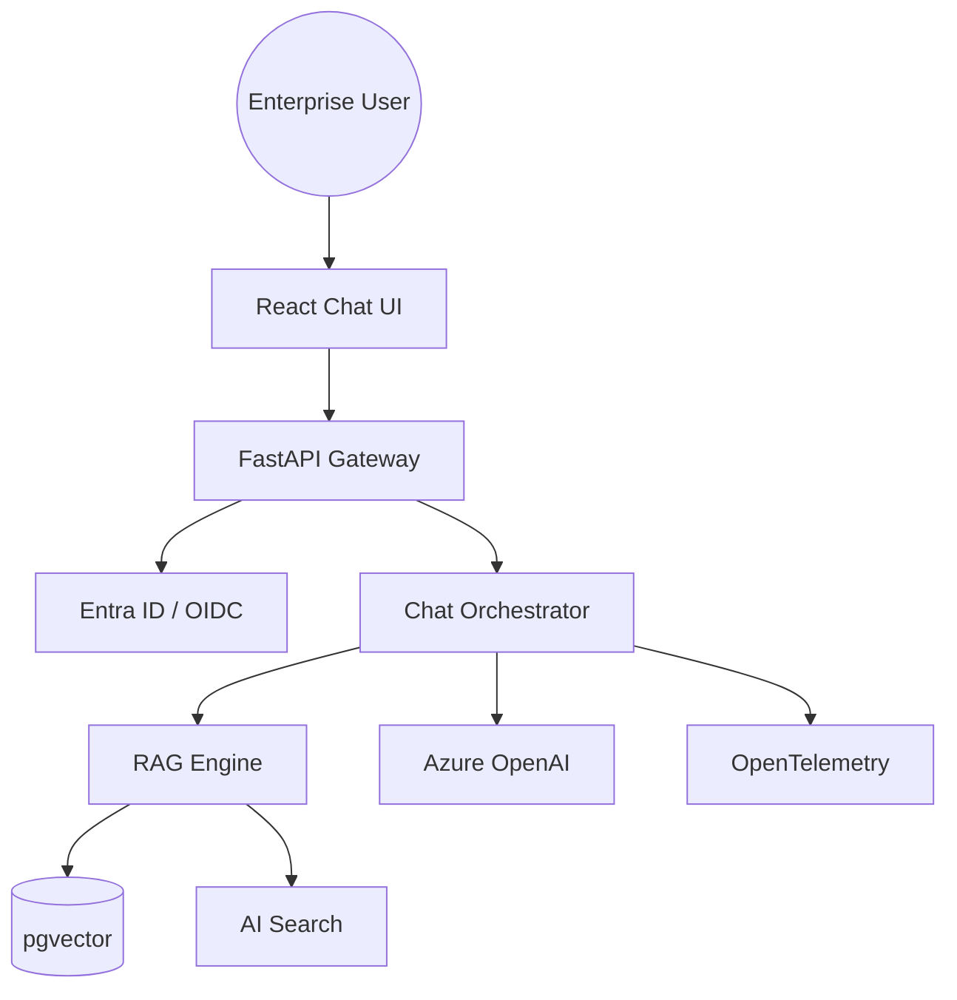

### 2. Detailed Component Topology
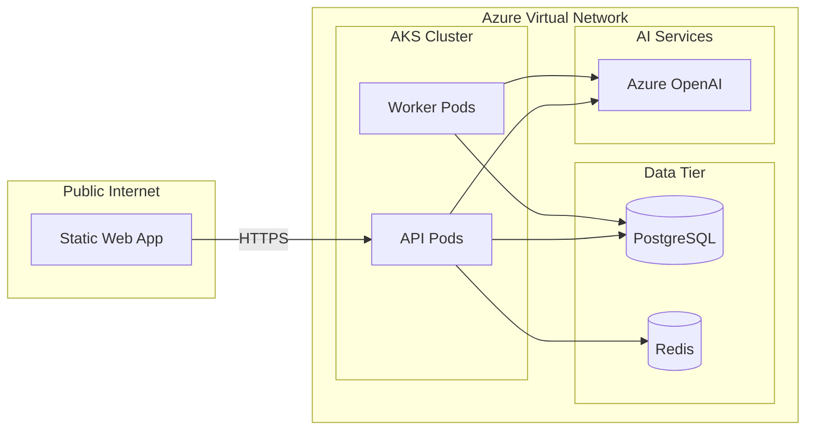

### 3. Frontend to Backend Request Path
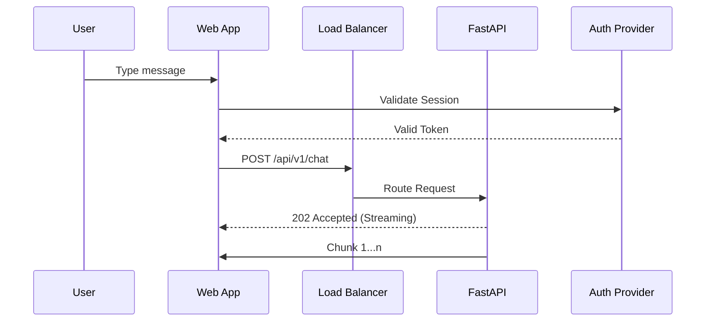

### 4. Backend Service Mesh View
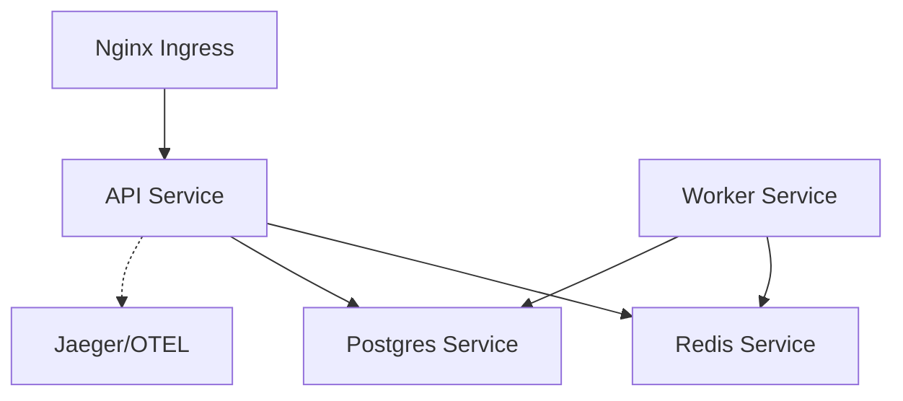

### 5. AI Gateway Architecture
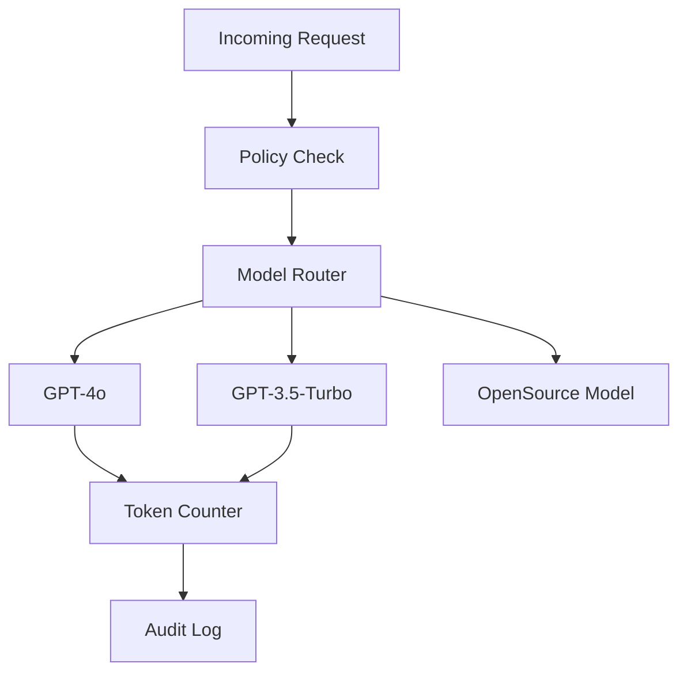

### 6. Multi-Model Routing Architecture
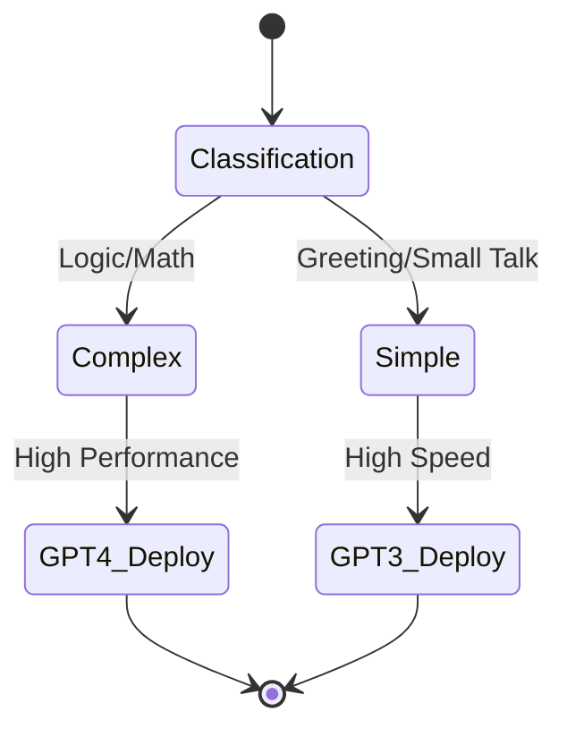

### 7. Multi-Tenant Architecture
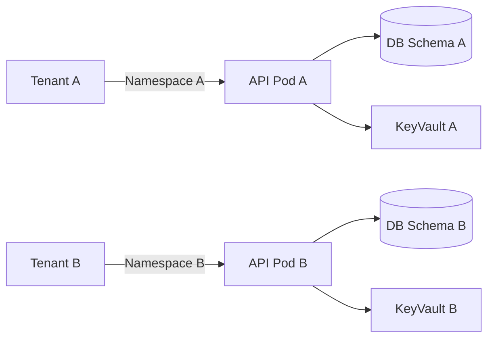

### 8. Regional Deployment Architecture
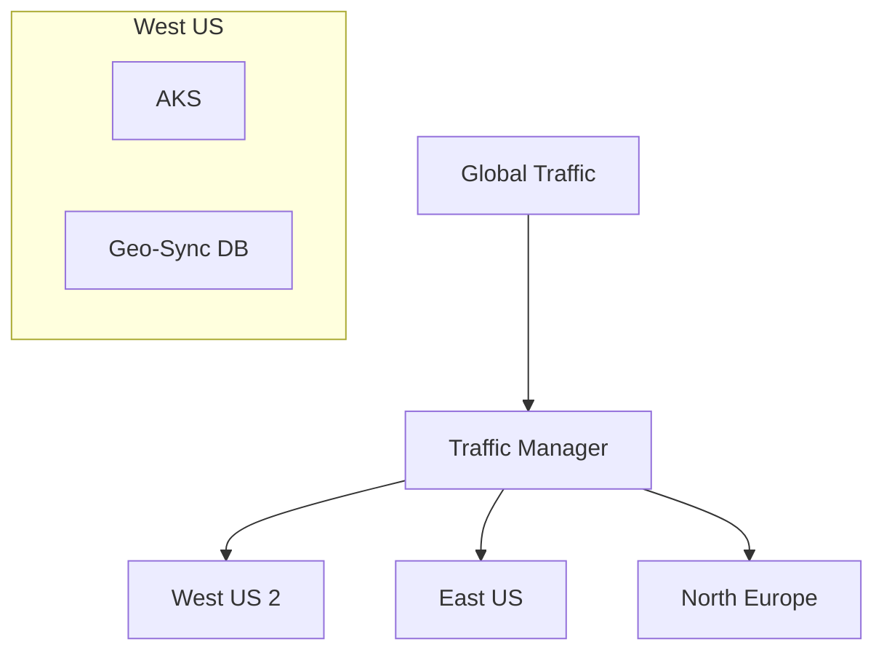

### 9. DR Failover Architecture
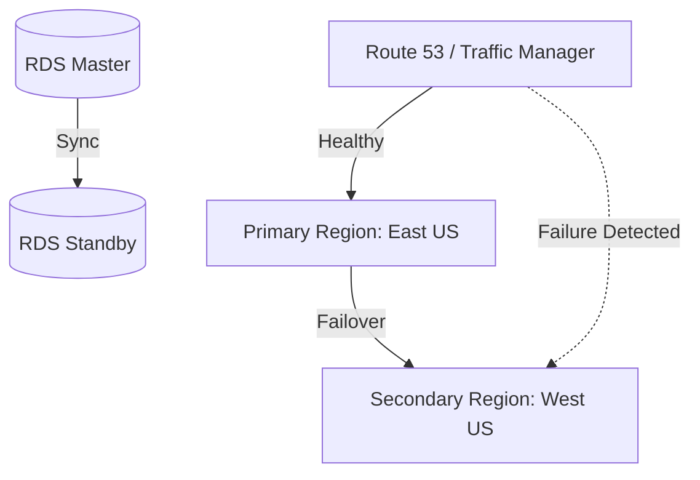

### 10. Blue/Green Deployment Architecture
```mermaid
graph LR
    User --> LB[Load Balancer]
    subgraph "Production"
        Blue[Blue: v1.0.0 (Active)]
    end
    subgraph "Staging"
        Green[Green: v1.1.0 (Testing)]
    end
    LB --> Blue
    LB -.->|Switch| Green
```

### 11. Document Upload Workflow
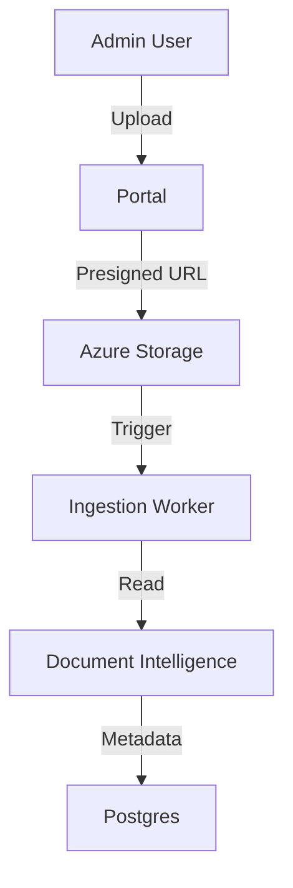

### 12. OCR Ingestion Pipeline
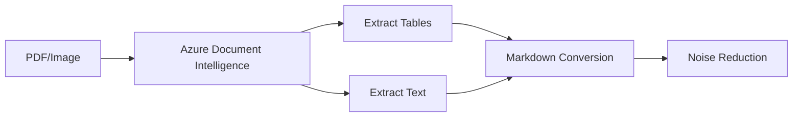

### 13. Chunking Workflow
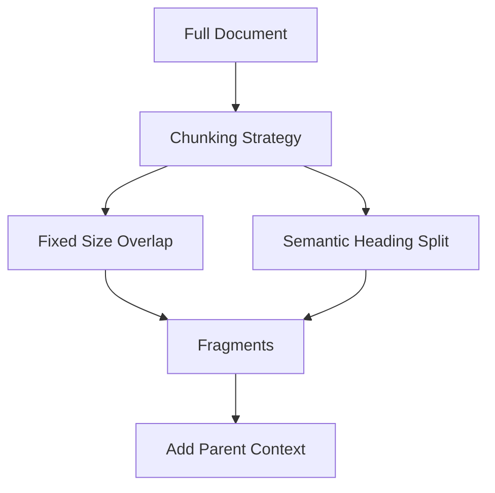

### 14. Embedding Generation Pipeline
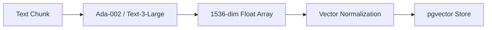

### 15. Vector Indexing Lifecycle
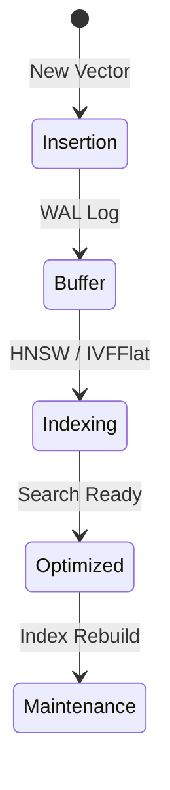

### 16. Retrieval Flow
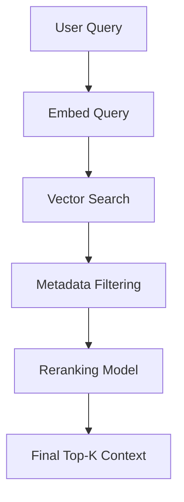

### 17. Citation Generation Flow
```mermaid
graph LR
    Context[Retrieved Chunks] --> LLM[Generation]
    LLM --> Answer[Draft Answer]
    Answer --> SourceMatch[Source Verification]
    SourceMatch --> Final[Answer with [1,2] Citations]
```

### 18. Hybrid Search Flow
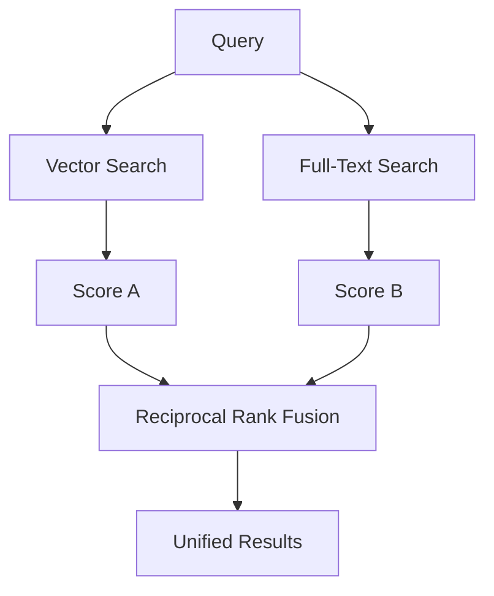

### 19. Data Freshness Sync Flow
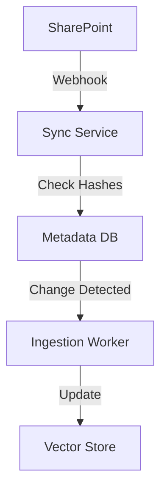

### 20. Reindex Workflow
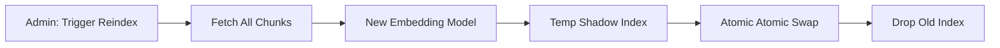

### 21. Zero Trust Trust-Boundary Model
```mermaid
graph TD
    User -->|Identity| WAF[Web Application Firewall]
    WAF -->|Validated| Front[Frontend Boundary]
    Front -->|mTLS| API[API Boundary]
    API -->|RBAC| DB[Data Boundary]
    API -->|Private Link| LLM[AI Boundary]
```

### 22. OIDC / SSO Authentication Flow
```mermaid
sequenceDiagram
    participant U as User
    participant A as App
    participant IDP as Entra ID
    
    U->>A: Click Login
    A->>IDP: Redirect to Authorize
    IDP->>U: Request Credentials
    U->>IDP: MFA / Password
    IDP-->>A: Authorization Code
    A->>IDP: Exchange Code for Token
    IDP-->>A: JWT ID Token
```

### 23. RBAC Permission Model
```mermaid
graph LR
    User[User] --> Role{Role Assignment}
    Role -->|User| Chat[Chat Interface]
    Role -->|Analyst| Reports[Analytics Dash]
    Role -->|Admin| Config[System Config]
    Role -->|Prompt Eng| Lab[Prompt Lab]
```

### 24. Secrets Management Flow
```mermaid
graph TD
    App[FastAPI] -->|Managed Identity| KV[Azure Key Vault]
    KV -->|Retrieve| Secret[OpenAI Key]
    Secret -->|Inject| Memory[App Memory]
    KV -.->|Rotate| NewKey[New OpenAI Key]
```

### 25. Private Networking Topology
```mermaid
graph TD
    User -->|Public IP| AppGateway[Azure App Gateway]
    subgraph "Private VNet"
        AppGateway -->|Private IP| AKS[Private AKS]
        AKS -->|Private Endpoint| SQL[Azure SQL]
        AKS -->|Private Link| OpenAI[Azure OpenAI]
    end
```

### 26. WAF Security Boundary
```mermaid
graph LR
    Traffic[Internet Traffic] --> WAF[WAF / Front Door]
    WAF -->|SQLi Check| Block1[Block Malicious]
    WAF -->|XSS Check| Block2[Block Malicious]
    WAF -->|DDoS Protect| Filter[Clean Traffic]
    Filter --> Ingress[AKS Ingress]
```

### 27. PII Redaction Pipeline
```mermaid
graph TD
    Input[User Message] --> NER[Entity Recognition]
    NER -->|Found| PII[Email/SSN/Phone]
    PII --> Replace[Redact/Anonymize]
    Replace --> Safe[Safe Message]
    Safe --> LLM[OpenAI]
```

### 28. Audit Logging Architecture
```mermaid
graph LR
    API[API Events] --> Queue[Event Hub]
    Queue --> Storage[Blob Storage]
    Queue --> LogAnalytics[Log Analytics]
    LogAnalytics --> Sentinel[Azure Sentinel]
```

### 29. Key Rotation Lifecycle
```mermaid
stateDiagram-v2
    [*] --> Active: Key v1
    Active --> Expiring: 30 Days Left
    Expiring --> Rotate: Generate v2
    Rotate --> Grace: Both Active
    Grace --> Deprecated: v1 Removed
    Deprecated --> [*]
```

### 30. Incident Response Flow
```mermaid
graph TD
    Alert[Monitoring Alert] --> Pager[PagerDuty / OpsGenie]
    Pager --> Team[Ops Team]
    Team --> Analyze[Sentinel Investigation]
    Analyze --> Remediate[Apply Patch/Config]
    Remediate --> PostMortem[Record Lessons]
```

### 31. GitHub Actions Pipeline
```mermaid
graph TD
    Push[Code Push] --> Lint[Linting / Formatting]
    Lint --> Test[Unit / Integration Tests]
    Test --> Build[Docker Build]
    Build --> Scan[Trivy Vulnerability Scan]
    Scan --> PushRepo[Push to ACR]
    PushRepo --> DeployDev[Deploy to Dev AKS]
```

### 32. Terraform Deployment Workflow
```mermaid
graph LR
    TF_Code[Terraform Code] --> Plan[TF Plan]
    Plan --> Approval[Review Approval]
    Approval --> Apply[TF Apply]
    Apply --> State[Update S3 State]
```

### 33. Docker Image Promotion Flow
```mermaid
stateDiagram-v2
    [*] --> DevRegistry: Build v1.0.0
    DevRegistry --> Staging: Passed Dev QA
    Staging --> ProdRegistry: Tag v1.0.0-Stable
    ProdRegistry --> Production: Blue/Green Swap
```

### 34. AKS Deployment Flow
```mermaid
graph TD
    Helm[Helm Chart] --> Release[Helm Release]
    Release --> Pods[Update ReplicaSet]
    Pods --> Health[Readiness Probe]
    Health -->|Success| Active[Active Service]
```

### 35. Rollback Workflow
```mermaid
graph LR
    Alert[Failure Detected] --> Command[Helm Rollback]
    Command --> Prev[Previous ReplicaSet]
    Prev --> Traffic[Traffic Re-routed]
    Traffic --> Recovery[System Restored]
```

### 36. Drift Detection Workflow
```mermaid
graph TD
    Cron[Daily Job] --> Plan[TF Plan]
    Plan --> Diff{Drift Detected?}
    Diff -->|Yes| Notify[Slack Alert]
    Diff -->|No| Success[End]
```

### 37. Branching Strategy Model
```mermaid
graph LR
    Feat[Feature Branch] -->|PR| Develop[Develop Branch]
    Develop -->|Merge| Release[Release Branch]
    Release -->|Tag| Main[Main / Prod Branch]
```

### 38. Release Management Workflow
```mermaid
graph TD
    Spec[Feature Spec] --> Dev[Sprint Development]
    Dev --> QA[Quality Assurance]
    QA --> Signoff[Business Sign-off]
    Signoff --> Prod[Production Release]
```

### 39. Metrics Pipeline
```mermaid
graph LR
    Pod[App Pods] -->|Scrape| Prom[Prometheus]
    Prom -->|Query| Grafana[Grafana Dashboards]
    Grafana --> Alerts[Alertmanager]
```

### 40. Logging Pipeline
```mermaid
graph TD
    App[Containers] -->|stdout| FluentBit[FluentBit]
    FluentBit -->|Forward| Storage[Log Analytics]
    Storage --> Kusto[Kusto Queries]
    Kusto --> Dash[Insights Dashboard]
```

### 41. Distributed Tracing Flow
```mermaid
sequenceDiagram
    participant UI as Browser
    participant API as API
    participant DB as Postgres
    participant AI as OpenAI
    
    UI->>API: Request (Span ID: 123)
    API->>DB: Query (Span ID: 123.1)
    DB-->>API: Data
    API->>AI: Prompt (Span ID: 123.2)
    AI-->>API: Response
    API-->>UI: Result
```

### 42. Alert Escalation Workflow
```mermaid
graph TD
    Crit[Critical Alert] --> Slack[Slack Notification]
    Slack -->|No Response| SMS[SMS Alert]
    SMS -->|No Response| Phone[Phone Call Escalation]
```

### 43. Capacity Scaling Workflow
```mermaid
graph TD
    Load[High CPU/Memory] --> Metric[HPA Metric]
    Metric --> Scale[K8s Scale Pods]
    Scale --> AddNode[Cluster Autoscaler]
    AddNode --> Capacity[Increased Capacity]
```

### 44. Queue Worker Flow
```mermaid
graph LR
    API[API Request] -->|Push| Redis[Redis Queue]
    Redis -->|Pop| Worker[Python Worker]
    Worker -->|Execute| Task[Ingestion/Report]
    Task -->|Update| Status[Postgres Status]
```

### 45. Cost Governance Flow
```mermaid
graph TD
    Usage[Token Usage] --> Calc[Cost Calculator]
    Calc --> Budget[Budget Alert]
    Budget --> Policy[Resource Throttling]
```

### 46. SLA Monitoring Flow
```mermaid
graph LR
    Probe[Health Probes] --> Monitor[Uptime Monitor]
    Monitor -->|99.9%| Success[SLA Met]
    Monitor -->|Below| Breach[SLA Breach Alert]
```

### 47. End-User Chat Journey
```mermaid
graph TD
    Ask[User Asks Question] --> Wait[See Typing Indicator]
    Wait --> Read[Receive Streaming Answer]
    Read --> Action[Click Citation / Source]
    Action --> Feedback[Give Thumbs Up/Down]
```

### 48. Admin Onboarding Workflow
```mermaid
graph LR
    Req[New Bot Request] --> Appr[Admin Approval]
    Appr --> Create[Provision Resources]
    Create --> Config[Setup Prompt/Data]
    Config --> Ready[Bot Live]
```

### 49. Prompt Engineer Lifecycle
```mermaid
stateDiagram-v2
    [*] --> DraftPrompt: Write
    DraftPrompt --> Test: Playground
    Test --> Refine: Logic Adjust
    Refine --> Version: Tag v2.1
    Version --> Production: Deploy
```

### 50. Analyst Reporting Workflow
```mermaid
graph TD
    Logs[Raw Audit Logs] --> Query[Kusto / SQL Query]
    Query --> Visualize[PowerBI / Grafana]
    Visualize --> Review[Monthly Review]
    Review --> Strategic[Platform Roadmap]
```

---

## 🚦 Getting Started

### 1. Prerequisites
- **Azure Subscription** with OpenAI access enabled.
- **Docker Desktop** installed.
- **Terraform CLI** (v1.5+).
- **Node.js** (v18+) and **Python** (v3.11+).

### 2. Local Infrastructure (Docker Compose)
```bash
cp .env.example .env
docker-compose up --build
```

### 3. Frontend Development
```bash
cd apps/web && npm install && npm run dev
```

### 4. Backend Development
```bash
cd apps/api && pip install -r requirements.txt && uvicorn app.main:app --reload
```

---

## 🛠️ Deployment Guide

### Azure Infrastructure (Terraform)
```bash
cd infrastructure/terraform/envs/prod
terraform init
terraform apply
```

---

## 🛡️ Governance & Security
- **Identity-First**: Every request must be authenticated via OIDC.
- **Micro-Segmentation**: Network policies restrict traffic between pods.
- **Data Sovereignty**: All AI data remains within the enterprise-controlled Azure tenant.

---

## 📈 Roadmap
- [ ] **Multi-Modal Support**: Ingestion and chat with images and audio.
- [ ] **Agentic Workflows**: Tool-calling capabilities for executing actions.
- [ ] **Advanced Reranking**: Integration with Cohere/BGE rerankers.

---
<sub>&copy; 2026 Devopstrio &mdash; Engineering the Future of Enterprise Intelligence.</sub>
