<div align="center">


<h1>Chatbot Accelerator</h1>

<p><strong>The Institutional-Grade Platform for Standardized GenAI Foundations, AI Governance, and Multi-Cloud Chatbot Ecosystems.</strong></p>

[]()
[]()
[]()

<br/>

> **"Industrializing enterprise AI to automate conversational foundations."** 
> **Chatbot Accelerator** is an enterprise-grade platform designed to provide a secure, measurable, and highly automated foundation for global AI operations. It orchestrates the complex lifecycle of Generative AI—from automated document ingestion and multi-cloud RAG reconciliation to high-throughput token intelligence and unified AI auditing.

</div>

---

## 🏛️ Executive Summary

Experimental GenAI and lack of enterprise governance are strategic operational liabilities; lack of a standardized AI assistant framework is a primary barrier to organizational engineering maturity. Organizations fail to deploy production AI not because of a lack of models, but because of fragmented evaluation standards, lack of automated RAG reconciliation, and an inability to orchestrate AI planes with operational precision.

This platform provides the **AI Intelligence Plane**. It implements a complete **Chatbot-Accelerator-as-Code Framework**, enabling CTOs and AI Architects to manage global AI foundations as first-class citizens. By automating the identification of model regressions through real-time telemetry analysis and orchestrating the provisioning of secure performance-driven AI policies, we ensure that every organizational assistant—from core customer support bots to edge employee copilots—is governed by default, audited for history, and strictly aligned with institutional AI frameworks.

---

## 📐 Architecture Storytelling: Principal Reference Models

### 1. Principal Architecture: Global Chatbot Accelerator & AI Intelligence Plane
This diagram illustrates the end-to-end flow from AI telemetry ingestion and multi-cloud orchestration to assistant enforcement, performance validation, and institutional AI auditing.

```mermaid
graph LR
    %% Subgraph Definitions
    subgraph AI_Ingress["Source & Context Ingress"]
        direction TB
        Knowledge_Signals["SharePoint / Wikis / PDF Ingestion"]
        Prompt_Definitions["System Instructions / Tool Schemas"]
        User_Telemetry["Interaction Logs / Feedback Signals"]
    end

    subgraph IntelligenceEngine["AI Intelligence Hub"]
        direction TB
        API["FastAPI AI Gateway"]
        RAGOrchestrator["Global RAG & Vector Hub"]
        Governance_Hub["Compliance & Guardrail Hub"]
        AIOps_Validator["Drift & Hallucination Analysis Hub"]
    end

    subgraph OperationsPlane["Distributed AI Ecosystem"]
        direction TB
        ManagedChatNodes["Managed Standardized Assistant Hubs"]
        ActiveRunbooks["Managed Automated Prompt Runbooks"]
        ModelSinks["Managed Infrastructure Delivery Hubs"]
    end

    subgraph OperationsHub["Institutional Data Hub"]
        direction TB
        Scorecard["AI Maturity Scorecard"]
        Analytics["Token Flow & ROI Velocity Stats"]
        Audit["Forensic AI Metadata Lake"]
    end

    subgraph DevOps["Chatbot-Accelerator-as-Code Framework"]
        direction TB
        TF["Terraform AI Modules"]
        DriftBot["Productivity & Config Drift Validator"]
        ChatOps["Measurement Operations Hub"]
    end

    %% Flow Arrows
    AI_Ingress -->|1. Submit Telemetry| API
    API -->|2. Orchestrate AI| RAGOrchestrator
    RAGOrchestrator -->|3. Apply Privacy Guard| Governance_Hub
    Governance_Hub -->|4. Assess Drift| AIOps_Validator
    
    AIOps_Validator -->|5. Execute Inference| OperationsPlane
    OperationsPlane -->|6. Notify Status| ChatOps
    API -->|7. Visualize Health| Scorecard
    
    Scorecard -->|8. Track Maturity| Analytics
    Scorecard -->|9. Record Performance| Audit
    
    TF -->|10. Provision Backbone| IntelligenceEngine
    DriftBot -->|11. Inject Friction Risk| RAGOrchestrator
    Audit -->|12. Improve Operations| ManagedChatNodes

    %% Styling
    classDef ingress fill:#f5f5f5,stroke:#616161,stroke-width:2px;
    classDef intel fill:#e8eaf6,stroke:#1a237e,stroke-width:2px;
    classDef operations fill:#e1f5fe,stroke:#01579b,stroke-width:2px;
    classDef ops fill:#ede7f6,stroke:#311b92,stroke-width:2px;
    classDef devops fill:#e8f5e9,stroke:#1b5e20,stroke-width:2px;

    class AI_Ingress ingress;
    class IntelligenceEngine intel;
    class OperationsPlane operations;
    class OperationsHub ops;
    class DevOps devops;
```

### 2. The AI Lifecycle Flow
The continuous path of an enterprise AI platform from initial integration (ingest) and aggregation (embed) to active analysis (retrieve), optimization (generate), and institutional forensic auditing (scorecard).

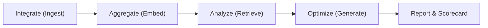

### 3. Distributed AI Topology
Strategically orchestrating standardized AI across global regions, diverse model architectures, and multi-cloud targets, providing a unified institutional view of global AI health and operational readiness.

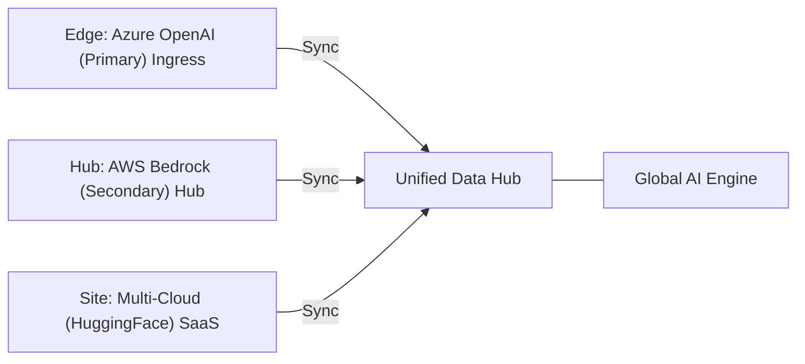

### 4. AI Hub & High-Trust Data Plane Protection Flow
Executing complex logic for securing the bridge between AI owners and technical teams, ensuring every organizational identity is verified, knowledge-level privacy is maintained, and every AI access is according to institutional standards.

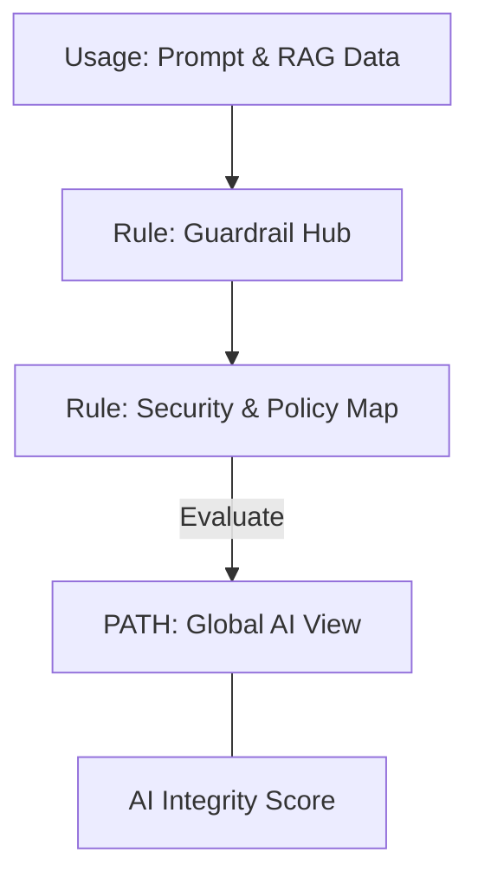

### 5. Multi-Cloud AI Federation & Governance Flow
Automatically managing unified AI standards across global regions and diverse cloud tenants, ensuring institutional data residency and privacy boundaries by default.

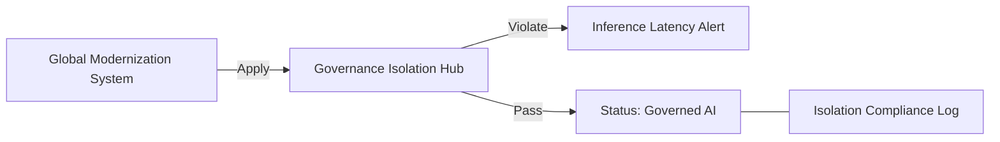

### 6. Encryption & Perimeter Protection Flow (AI Standard)
Managing the lifecycle of an AI request, automatically enforcing institutional TLS 1.3 and resource encryption standards as required by security policy, ensuring zero-latency security confidence.

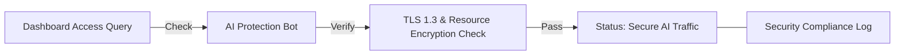

### 7. Institutional AI Maturity Scorecard
Grading organizational performance based on key indicators: Hallucination Rate Index, RAG Relevance Index, and AI Adoption Scores.

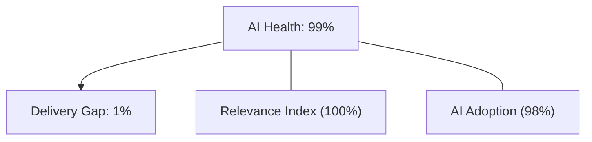

### 8. Identity & RBAC for AI Governance
Managing fine-grained access to AI hubs, provisioning workers, and audit logs between CTOs, AI Leads, and Prompt Engineers.

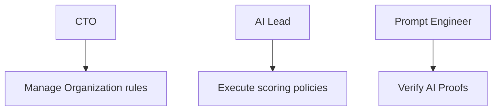

### 9. IaC Deployment: Chatbot-Accelerator-as-Code Framework
Using modular Terraform to deploy and manage the versioned distribution of the AI tracking hubs, sync protection workers, and forensic metadata lakes.

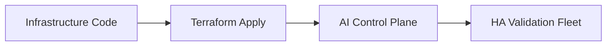

### 10. AIOps AI Drift & Risk Validation Flow
Using advanced analytics to identify sudden surges in token usage, unauthorized model changes, suspicious configuration drifts, or unusual delivery pattern changes that could result in institutional risk or downtime.

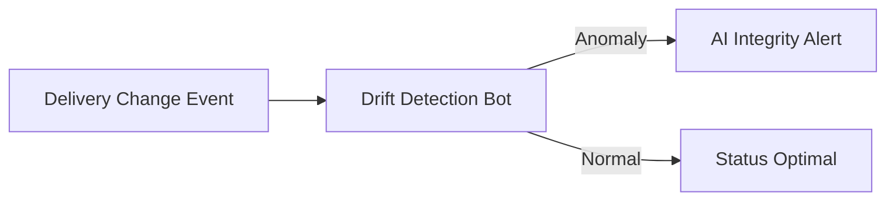

### 11. Metadata Lake for Forensic AI Audit
Storing long-term records of every AI integration event (metadata), every inference executed, and every version history for institutional record-keeping, compliance auditing, and post-provisioning forensics.

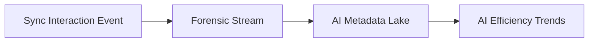

---

## 🏛️ Core Governance Pillars

1.  **Unified Foundation Coordination**: Maximizing resilience by centralizing all AI measurement through a single institutional plane.
2.  **Automated RAG Provisioning**: Eliminating "manual ingestion" scenarios through proactive orchestration and pattern verification.
3.  **Sequential AI Intelligence**: Ensuring zero-interruption operations through dependency-aware prompt-driven data engineering.
4.  **Zero-Trust Identity Protection**: Automatically enforcing identity-based access, data-at-rest encryption, and policy evaluation across all assurance tiers.
5.  **Autonomous Operations Logic**: Guaranteeing reliability through automated industry-specific effectiveness monitoring runbooks.
6.  **Full AI Auditability**: Immutable recording of every prompt change and AI provision for institutional forensics.

---

## 🛠️ Technical Stack & Implementation

### AI Engine & APIs
*   **Framework**: Python 3.11+ / FastAPI.
*   **Performance Engine**: Custom Python-based logic for multi-cloud RAG reconciliation and DORA-style AI metrics.
*   **Integrations**: Native connectors for Azure OpenAI, AWS Bedrock, and pgvector toolchains.
*   **Persistence**: PostgreSQL (AI Ledger) and Redis (Live Inference State).
*   **Auth Orchestrator**: Federated OIDC/SAML for least-privilege AI management access.

### Governance Dashboard (UI)
*   **Framework**: React 18 / Vite.
*   **Theme**: Dark, Slate, Indigo (Modern high-fidelity productivity aesthetic).
*   **Visualization**: D3.js for delivery topologies and Recharts for ROI velocity analytics.

### Infrastructure & DevOps
*   **Runtime**: AWS EKS or Azure Kubernetes Service (AKS) for management plane.
*   **Measurement Hub**: Managed event sourcing for immutable productivity timeline reconstruction.
*   **IaC**: Modular Terraform for deploying the AI landing zone and validation fleet.

---

## 🏗️ IaC Mapping (Module Structure)

| Module | Purpose | Real Services |
| :--- | :--- | :--- |
| **`infrastructure/ai_hub`** | Central management plane | EKS, PostgreSQL, Redis |
| **`infrastructure/enforcers`** | Distributed assistant provisioners | Azure, AWS, GCP APIs |
| **`infrastructure/ai_pipes`** | Data Ingestion Hubs | Webhooks, Lambda |
| **`infrastructure/auditing`** | Forensic modernization sinks | S3, Athena, Quicksight |

---

## 🚀 Deployment Guide

### Local Principal Environment
```bash
# Clone the Chatbot Accelerator repository
git clone https://github.com/devopstrio/chatbot-accelerator.git
cd chatbot-accelerator

# Configure environment
cp .env.example .env

# Launch the AI stack
make init

# Trigger a mock AI update and automated guardrail validation simulation
make simulate-chat
```

Access the Management Portal at `http://localhost:3000`.

---

## 📜 License
Distributed under the MIT License. See `LICENSE` for more information.

---
<div align="center">
  <p>© 2026 Devopstrio. All rights reserved.</p>
</div>
